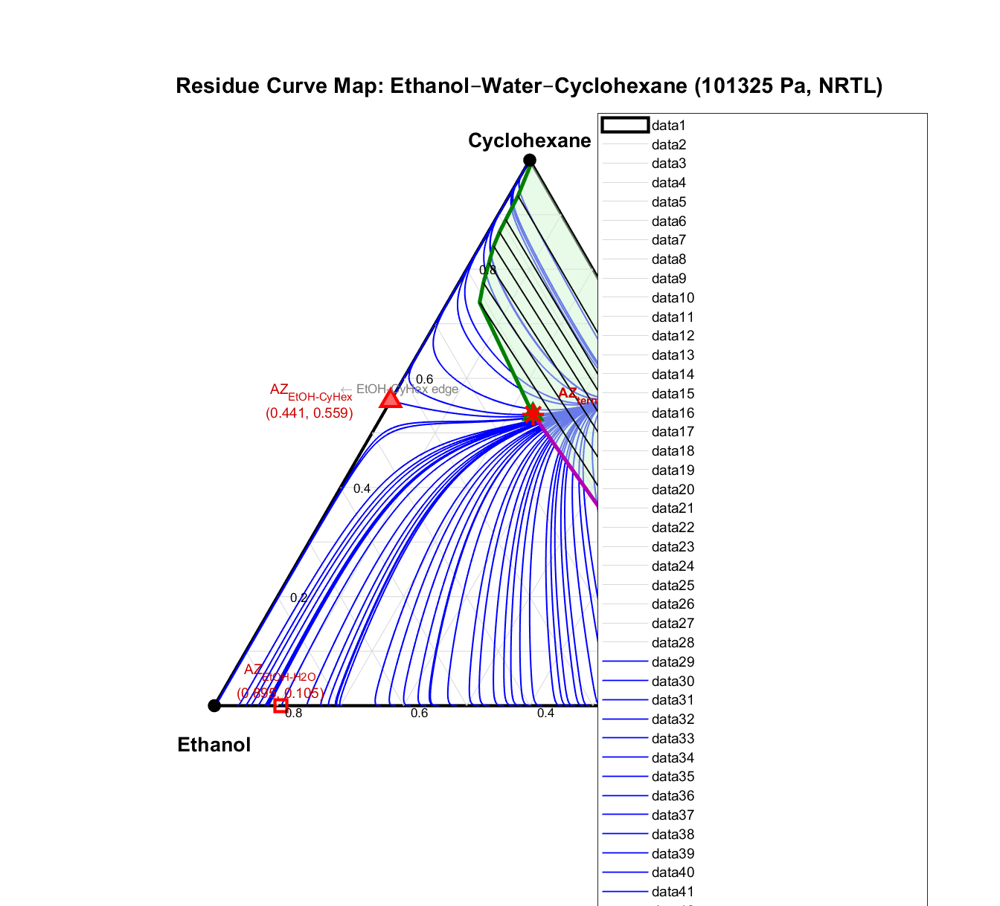

# Heterogeneous Azeotropic Distillation Simulator (MATLAB)

A two-column, stage-by-stage MATLAB simulator for breaking the ethanol-water azeotrope using **cyclohexane as entrainer** — developed as my undergraduate research project in Chemical Engineering at Ladoke Akintola University of Technology (LAUTECH).


## Process description

Feed (ethanol + water + cyclohexane) enters **Column 1** (the main azeotropic column). The overhead vapour condenses and phase-splits in a **decanter**:

- **Organic phase** (cyclohexane-rich) → recycled to Column 1 as entrainer
- **Aqueous phase** (ethanol + water) → fed to **Column 2** (recovery column)

Column 1 bottoms yield high-purity ethanol; Column 2 bottoms yield essentially pure water; Column 2's distillate (dilute ethanol/water) is recycled back to the Column 1 feed.

## Modelling approach

- **Column model:** stage-by-stage Lewis-Matheson method — enriching and stripping sections solved separately, stepping in from specified terminal compositions
- **Thermodynamics:** modified Raoult's law with **NRTL activity coefficients** (Renon & Prausnitz, 1968)
- **Vapour pressures:** DIPPR 101 extended Antoine equation, DIPPR 801 parameter set
- **Decanter liquid-liquid split:** ternary EtOH-H2O-CyHex equilibrium solved by Gibbs free energy minimisation, validated against tie-line data from Gomis et al. (2000)
- **Residue curve map:** generated for the full ternary system, identifying the binary and ternary heterogeneous azeotropes and the distillation boundary



Beyond the core simulator, the repository includes a design-of-experiments (DOE) sensitivity study of reflux ratio, entrainer-to-feed ratio, and stage count against condenser temperature and reboiler/condenser heat duty, plus a MATLAB App Designer GUI front-end for running cases interactively.

## Repository contents

| File | Description |
|---|---|
| `runsimulation.m` | Main simulation engine — full two-column, stage-by-stage solve |
| `AZEOTROPIC_GUI.mlapp` | MATLAB App Designer GUI front-end for `runsimulation.m` |
| `activity_coeff_NRTL.m` | NRTL activity coefficient model |
| `psat_T.m` | Pure-component vapour pressure via the extended Antoine equation |
| `dpsat_dT.m` | Analytical derivative of vapour pressure with respect to temperature |
| `total_pressure.m` / `total_pressure_error.m` | Modified Raoult's law residual, used as the bubble-point root-finding objective |
| `VLE_bubble.m` | Bubble-point temperature and equilibrium vapour composition solver |
| `decanter_LLE.m` | Ternary liquid-liquid equilibrium solver for the decanter (Gibbs energy minimisation) |
| `B2_CHECK.m` | Bottoms-flow initial-guess helper for Column 2 |
| `generate_RCM.m` | Generates the residue curve map and LLE envelope for the ternary system |
| `DOE.m` | Validates optimizer-proposed operating points against full simulation |
| `DOE_table.m` / `run_DOE_table.m` | Runs the design-of-experiments sensitivity study |
| `DOE_results.csv`, `DOE_validation.csv` | DOE study output data |
| `sensitivity_fig1.m` | Reflux ratio (R1) vs. distillate composition and heat duty |
| `sensitivity_fig2.m` | Stage count (n1) and reflux ratio vs. total heat duty |
| `sensitivity_fig3.m` | Entrainer-to-feed ratio and reflux ratio vs. total heat duty |

## Requirements

- MATLAB (R2020a or later recommended for `.mlapp` compatibility)
- Optimization Toolbox (used by `decanter_LLE.m` for the constrained Gibbs-energy minimisation)

## How to run

Run a single case from the command line:

```matlab
[Result, plotData] = runsimulation(F, conv, P1, P2, n1, n2, R1, R2, ...
                                    ethfracf, watfracf, entfracf, ...
                                    ethfracb, H2Ofracb, ethfracd);
```

See the header comment in `runsimulation.m` for the full input/output specification. Or, launch the interactive GUI:

```matlab
AZEOTROPIC_GUI
```

To generate the residue curve map:

```matlab
generate_RCM
```

To reproduce the design-of-experiments sensitivity study:

```matlab
run_DOE_table
```

## Background

This simulator was developed in 2025 as part of my BTech research project and is the basis of a manuscript currently under review. My broader research interest is in extending this kind of numerical process modelling toward computational fluid dynamics for multiphase flow — resolving the gas-liquid interactions that a stage-by-stage model like this one approximates rather than spatially resolves.

## Author

Adewumi Damola Philip — [adewumidamolaphilip@gmail.com](mailto:adewumidamolaphilip@gmail.com)
